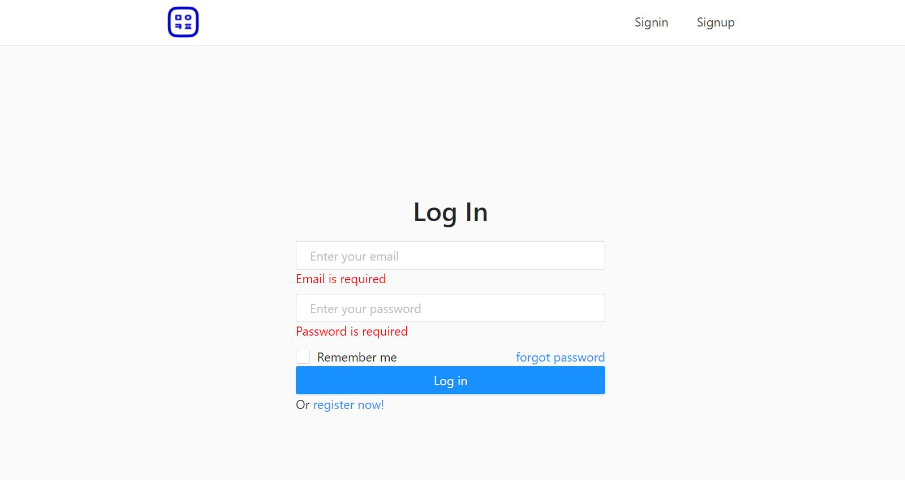
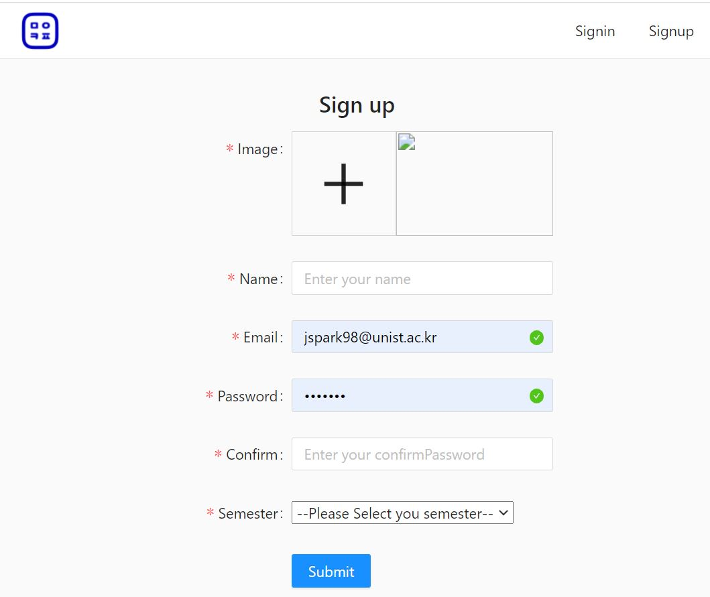
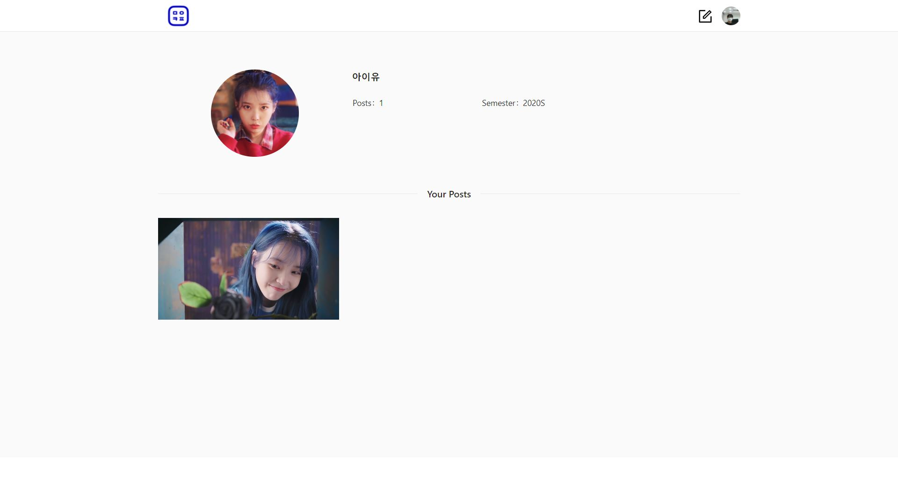
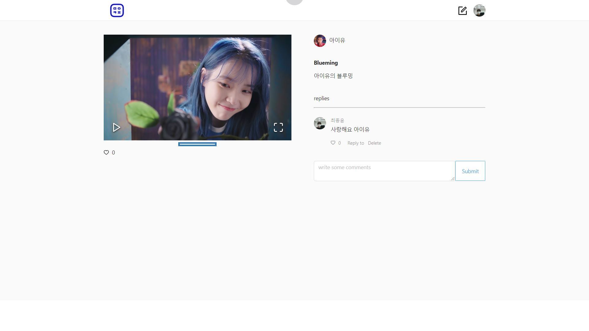
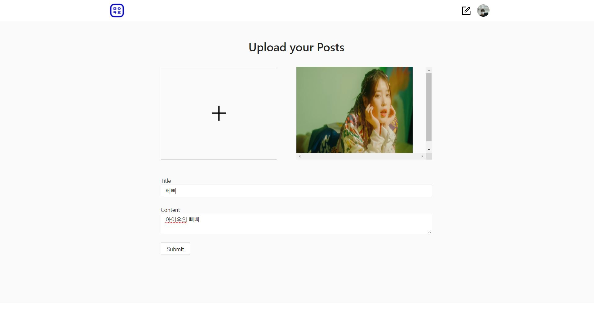

# Madstagram

몰입캠프 활동 사진들을 게시물로 올리고 좋아요, 댓글을 달 수 있는 몰입스타그램을 만들었다. 기수별로 활동 사진을 기록할 수 있다.

> 개발자 : 박종서, 최종윤 
> 
> React, Node, MongoDB

## 기능 설명

- Login
   - 가입 한 이메일로 로그인이 가능하다.
   - 이메일과 패스워드는 정확한 정보를 입력하지 않을 경우 붉은색 알람이 뜬다.
   - 
   
- Register
   - 자신의 프로필 이미지와 이름, 이메일, 비밀번호, 몰입캠프 학기를 입력하고 가입할 수 있다.
   - 
  
- User profile
   - 자신이 설정한 프로필을 볼 수 있다.
   - 사진과 이름, 게시글 갯수, 몰입캠프 학기가 나온다. 자신에게만 프로필 수정 버튼이 보인다.
   - 자신이 올린 게시물을 볼 수 있고, 클릭하면 상세 페이지로 이동한다.
   - 

- Home
   - 몰입캠프 학기 별로 가입한 친구들, 게시물 리스트를 볼 수 있다.
   - 게시글 카드 위 작성자를 클릭하면 작성자의 프로필로 갈 수 있다.
   - 사진이 2개 이상이면 자동으로 사진이 넘어가진다.
   - 카드 아래 좋아요와 댓글 갯수를 확인할 수 있고, 댓글을 클릭하면 상세페이지로 이동한다.
   - 관리자는 학기를 추가할 수 있다.
   - 

- Posts detail
   - 사진이 2장 이상일 경우 react image gallery 를 이용해 넘겨보고 확대할 수 있다.
   - 제목과 내용, 댓글을 모두 확인할 수 있다.
   - 댓글에 대댓글도 달 수 있다.
   - 자신이 단 댓글만 삭제할 수 있다.
   - 자신이 작성한 글만 수정과 삭제가 가능하다.
   - 

- Posts upload
   - 사진올리는 칸과 제목, 내용 칸에 입력할 수 있다.
   - 

## DATABASE

   - MongoDB 를 사용해서 5개의 모델을 MongoSchema를 통해 만듬 (User, Post, Like, Semester, Comment)
   - NodeJS의 router 를 이용해 '/user', '/post', '/like', '/semester', '/comment' 5개의 url 구분 
