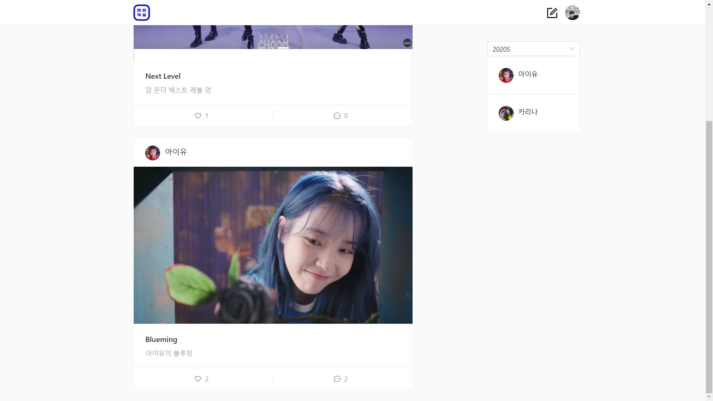

# Madstagram

몰입캠프 활동 사진들을 게시물로 올리고 좋아요, 댓글을 달 수 있는 몰입스타그램을 만들었다. 기수별로 활동 사진을 기록할 수 있다.

> 개발자 : 박종서, 최종윤 
> 
> React, Node, MongoDB

## Client

- Home
   - 모든 게시물을 리스트 형식으로 볼 수 있다.
   - 게시글 카드 위 작성자를 클릭하면 작성자의 프로필로 갈 수 있고, 아래 좋아요와 상세 페이지로 이동할 수 있는 기능이 있다.
   - 
- Login
   - 
- Register
- User profile
- Posts detail
- Posts upload

## Server

- 

## DATABASE

   - MongoDB 를 사용해서 5개의 모델을 MongoSchema를 통해 만듬 (User, Post, Like, Semester, Comment)
   - NodeJS의 router 를 이용해 '/user', '/post', '/like', '/semester', '/comment' 5개의 url 구분 
